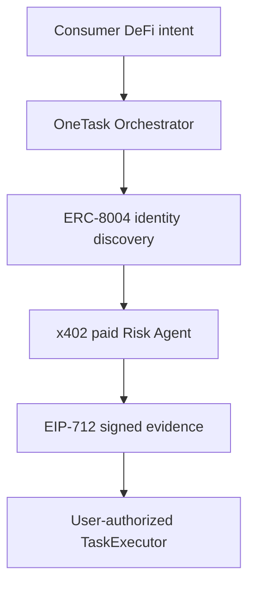

# OneTask DeFi

A consumer-facing, Agent-assisted DeFi execution prototype powered by ERC-8004, x402, EIP-712, ERC-4626, and constrained smart-contract execution.

> Status: Portfolio MVP complete.  
> All assets and transactions are restricted to local Anvil or public testnets.  
> This project is not audited and must not be used with real funds.

## Product Goal

OneTask turns a user's DeFi intent into a verifiable execution plan.

Instead of trusting an arbitrary AI service URL, the Orchestrator:

1. Reads the user's live vault position.
2. Builds a constrained migration plan.
3. Discovers a registered Risk Agent through ERC-8004.
4. Verifies the Agent's onchain identity and registered service metadata.
5. Pays the verified Agent endpoint through x402.
6. Receives deterministic, EIP-712-signed risk evidence.
7. Verifies the Agent wallet, evidence signature, hashes, and payment receipt.
8. Allows the user to authorize a constrained ERC-4626 vault migration.

## Verifiable Execution Flow



The AI Agent does not receive the user's private key and cannot submit arbitrary calldata.

## Current Demonstration

The local demonstration migrates a user's complete position from:

- Mock Vault A
- To Mock Vault B
- With a user-selected maximum-loss limit
- Using ERC-4626 previews
- Through a constrained `TaskExecutor`

The Risk Agent independently checks:

- Allowed execution chain
- Trusted executor
- Distinct vault addresses
- Nonzero source position
- Maximum-loss policy
- Minimum asset floor
- Minimum destination-share floor
- Quote integrity
- Plan lifetime
- Execution deadline
- Evidence-hash binding

## Architecture

| Component | Technology | Responsibility |
|---|---|---|
| Web application | Next.js, React, wagmi, viem, TanStack Query | Consumer interface, wallet connection, plan review, execution |
| Orchestrator | Fastify, TypeScript, PostgreSQL, viem | Builds plans, discovers Agents, pays services, verifies evidence |
| Risk Agent | Fastify, TypeScript, x402, EIP-712 | Evaluates migration risk and signs evidence |
| Smart contracts | Solidity, Foundry, OpenZeppelin | Mock token, ERC-4626 vaults, constrained execution |
| Identity layer | ERC-8004 on Base Sepolia | Agent discovery, ownership, wallet and metadata |
| Payment layer | x402 on Base Sepolia | Machine-to-machine payment for risk evaluation |

## Repository Structure

```text
apps/
├── orchestrator/
└── web/

services/
└── risk-agent/

packages/
└── contracts/
    ├── script/
    ├── src/
    └── test/
```

## ERC-8004 Test Identity

The Risk Agent has a real public-testnet identity registered on Base Sepolia.

| Field | Value |
|---|---|
| Network | Base Sepolia (`84532`) |
| Agent ID | `9228` |
| Identity Registry | `0x8004A818BFB912233c491871b3d84c89A494BD9e` |
| Agent Wallet | `0x82f6512c0d502319FF1Cd9f03E98DcDbF81fF51f` |
| Global Registry ID | `eip155:84532:0x8004A818BFB912233c491871b3d84c89A494BD9e` |

Public testnet transactions:

- [ERC-8004 registration transaction](https://sepolia.basescan.org/tx/0xadf38f66d2e58fa61611c449647e33139be7cad53dbab40b6d9a34edf1e7f4b7)
- [ERC-8004 metadata transaction](https://sepolia.basescan.org/tx/0x3b3c1c7fde15c76e490a02377871ca2d14338905f4cfda43db6723d0528e042a)
- [Verified x402 settlement transaction](https://sepolia.basescan.org/tx/0xd6dd41c97f2ccb25d24f3315867043e46527342ba7324492479f2bbe02093c1a)

The Agent registration uses an updateable onchain data URI. Its current service endpoint is local because this version is a local portfolio demonstration.

## Trust Boundaries

OneTask validates the complete service chain before allowing execution.

### ERC-8004 discovery

- Uses the configured Base Sepolia Identity Registry.
- Reads identity data from a configured Agent ID.
- Verifies the registered owner.
- Verifies the registered Agent wallet.
- Decodes and validates the onchain registration metadata.
- Requires an active registration with x402 support.
- Pins the discovered endpoint to the configured Risk Agent origin.

### x402 payment

- Uses a dedicated Base Sepolia test-only buyer account.
- Pays only the verified Agent service endpoint.
- Enforces a maximum amount per payment.
- Requires a successful settlement receipt.
- Verifies the settlement network and payer.
- Does not blindly retry ambiguous settlement failures.

### Signed evidence

- Uses an EIP-712 typed-data signature.
- Recovers and verifies the expected Agent wallet.
- Binds the signature to the request hash.
- Binds the signature to the migration-plan evidence hash.
- Rejects altered or structurally invalid evidence.

### Smart-contract execution

- Requires the caller to be the plan user.
- Requires distinct source and destination vaults.
- Requires both vaults to use the same asset.
- Enforces a deadline.
- Prevents nonce reuse.
- Requires a nonzero evidence hash.
- Enforces minimum assets received.
- Enforces minimum destination shares.
- Uses an exact vault-share allowance.
- Executes redemption and deposit atomically.

## Runtime Networks

This prototype deliberately separates the two environments:

| Function | Network |
|---|---|
| Vault state and migration | Local Anvil (`31337`) |
| ERC-8004 Agent identity | Base Sepolia (`84532`) |
| x402 payment | Base Sepolia (`84532`) |
| Risk evidence signing | Base Sepolia EIP-712 domain |

No mainnet wallet or real asset is required.

## Requirements

- Node.js `>=20.9.0`
- npm
- Foundry
- PostgreSQL
- A browser wallet for optional local Anvil execution

## Install Dependencies

From the repository root:

```bash
npm install
```

## PostgreSQL Setup

Create the local database:

```bash
createdb onetask_defi
```

Run the migration:

```bash
psql \
  -d onetask_defi \
  -v ON_ERROR_STOP=1 \
  -f apps/orchestrator/db/migrations/001_create_task_previews.sql
```

## Environment Configuration

Public templates are provided in:

- `apps/orchestrator/.env.example`
- `services/risk-agent/.env.example`

Create private local `.env` files from those templates and provide your own dedicated test-only credentials.

Never commit:

- Private keys
- Seed phrases
- Production RPC credentials
- Mainnet wallet credentials

The repository `.gitignore` excludes private `.env` files.

## Start the Local Services

Use separate terminal windows.

### 1. Local blockchain

```bash
anvil
```

### 2. Risk Agent

```bash
npm run dev \
  --workspace=@onetask/risk-agent
```

### 3. Orchestrator

```bash
npm run dev:orchestrator
```

### 4. Web application

```bash
npm run dev:web
```

The default local URLs are:

- Web: `http://localhost:3000`
- Orchestrator: `http://127.0.0.1:3001`
- Risk Agent: `http://127.0.0.1:3101`
- Anvil RPC: `http://127.0.0.1:8545`

## Verification Commands

### Web application

```bash
npm run lint \
  --workspace=@onetask/web

npm run build:web
```

### Orchestrator

```bash
npm run typecheck \
  --workspace=@onetask/orchestrator
```

### Risk Agent

```bash
npm run typecheck \
  --workspace=@onetask/risk-agent
```

### Smart contracts

```bash
npm run test:contracts
```

Current Foundry result:

```text
23 tests passed
0 tests failed
```

## Security Principles

- Use only local networks and public-testnet faucet assets.
- Never store a user's private key or seed phrase.
- Never let an LLM execute arbitrary calldata.
- Validate all external Agent responses.
- Discover and verify Agent identity before payment.
- Bind every Agent response to a specific plan hash.
- Require user authorization before final execution.
- Enforce critical constraints inside smart contracts.
- Treat frontend checks as explanation, not the final security boundary.

## Current Limitations

This is a portfolio MVP, not a production DeFi application.

- The DeFi execution contracts run locally on Anvil.
- The registered Agent endpoint currently points to localhost.
- Only one Risk Agent is implemented.
- The migration workflow currently supports one fixed vault pair.
- Natural-language intent is stored and previewed but is not yet converted into arbitrary execution routes.
- ERC-8004 identity and EIP-712 signatures are verified by the Orchestrator.
- `TaskExecutor` binds the evidence hash but does not yet verify the Agent signature onchain.
- Contracts have not received a professional security audit.
- Real funds and production wallets must not be used.

## Possible Next Iterations

- Publicly host the Risk Agent and update its ERC-8004 metadata.
- Deploy the vault demonstration to a public testnet.
- Add an onchain Agent-signature validator.
- Add route and simulation Agents.
- Store payment receipts and evidence in an audit log.
- Support multiple ERC-4626 vaults.
- Add automated integration and browser tests.
- Add reputation checks when the ERC-8004 reputation layer is available.

## Standards and Protocols

- [ERC-4626 Tokenized Vault Standard](https://eips.ethereum.org/EIPS/eip-4626)
- [ERC-8004 Trustless Agents](https://eips.ethereum.org/EIPS/eip-8004)
- [x402](https://x402.org/)
- [EIP-712 Typed Structured Data](https://eips.ethereum.org/EIPS/eip-712)

## License

MIT