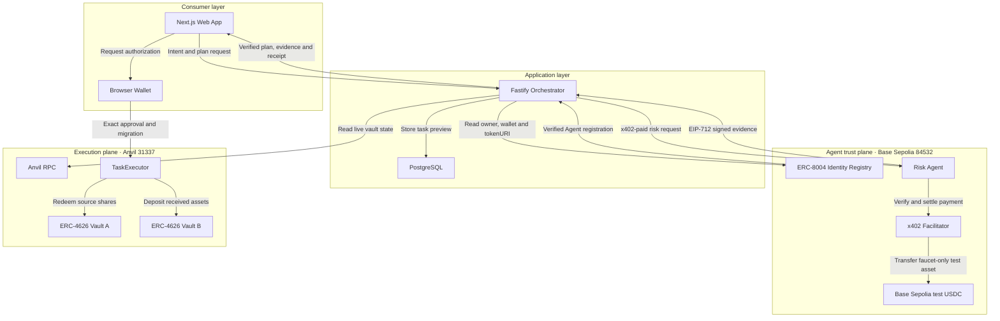
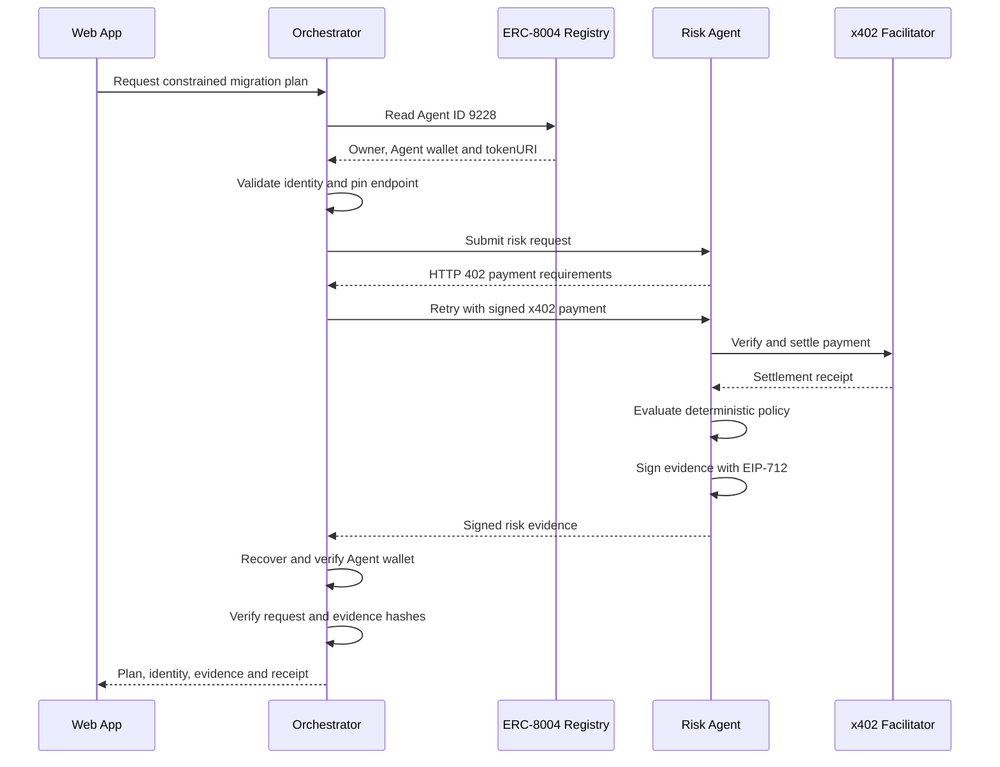
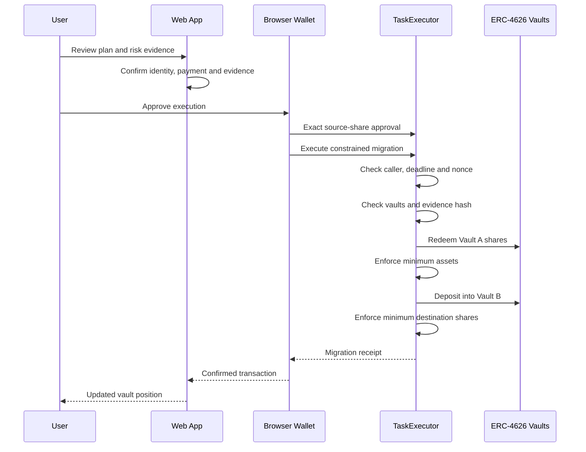

# OneTask DeFi Architecture

OneTask is a consumer-facing DeFi execution prototype that combines onchain Agent identity, machine-to-machine payments, signed risk evidence, and constrained smart-contract execution.

## System Architecture

## Agent Discovery and Evidence Flow

## User-Authorized Execution Flow

## Trust Chain

| Stage | Verification |
|---|---|
| Agent identity | Read from the configured ERC-8004 Identity Registry |
| Agent ownership | Registry owner must match the configured test Agent |
| Agent wallet | Registered wallet must match the EIP-712 signing wallet |
| Service endpoint | Endpoint must come from valid onchain metadata and match the configured origin |
| Payment | x402 receipt must be settled on Base Sepolia by the configured buyer |
| Risk evidence | Decision, checks, request hash and plan hash must be valid |
| Signature | EIP-712 signer must recover to the registered Agent wallet |
| User authorization | The browser wallet must match the migration-plan user |
| Contract execution | Deadline, nonce, vault assets and minimum outputs are enforced onchain |

## Main Security Boundaries

### Browser

The browser presents information and requests authorization, but it is not the final security boundary.

It cannot:

- Access the Orchestrator buyer private key
- Access the Risk Agent signing private key
- Modify a plan without invalidating its evidence binding
- Execute the migration without the user's wallet

### Orchestrator

The Orchestrator is responsible for:

- Reading live Anvil state
- Creating constrained execution parameters
- Discovering the Agent onchain
- Pinning the registered endpoint
- Creating the x402 payment
- Verifying the settlement receipt
- Verifying EIP-712 evidence
- Rejecting mismatched identities, hashes or networks

### Risk Agent

The Risk Agent:

- Does not control the user's wallet
- Does not submit the migration transaction
- Evaluates deterministic policy checks
- Returns signed evidence only after x402 settlement
- Uses a dedicated Base Sepolia test-only identity

### TaskExecutor

`TaskExecutor` is the final execution boundary.

It enforces:

- Caller equals plan user
- Nonexpired deadline
- Unused nonce
- Distinct vaults
- Matching vault assets
- Nonzero evidence hash
- Minimum redeemed assets
- Minimum destination shares
- Atomic rollback when any constraint fails

## Network Separation

| Plane | Network | Purpose |
|---|---|---|
| DeFi execution | Anvil `31337` | Local vault and executor demonstration |
| Agent identity | Base Sepolia `84532` | ERC-8004 Agent registration |
| Agent payment | Base Sepolia `84532` | x402 faucet-only test USDC settlement |
| Evidence signature | EIP-712 domain `84532` | Agent evidence authentication |

The separation is intentional for this portfolio MVP: DeFi execution remains fully local while Agent identity and machine payments provide publicly verifiable testnet evidence.

## Current Limitations

- The Risk Agent service endpoint currently points to localhost.
- Only one Risk Agent is implemented.
- Only one fixed vault-migration route is implemented.
- Agent evidence is verified by the Orchestrator, not yet by `TaskExecutor`.
- The contracts are tested but have not received a professional audit.
- The project must not be used with real funds.